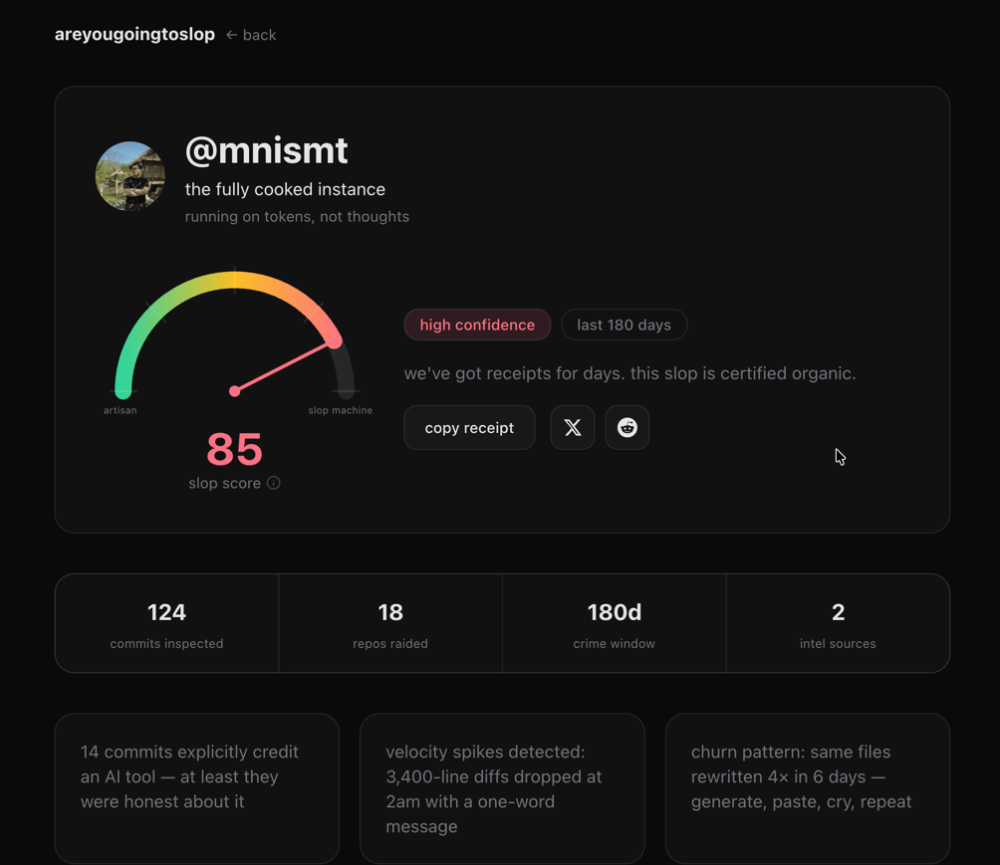

# areyougoingtoslop

> paste a github username. we'll judge their commits so you don't have to.

a heuristic that estimates how AI-assisted a developer's recent public contributions look, then assigns them a **slop score (0–100)** and a tier name they probably deserve.

it's satire. it's directionally credible. it's not a lie detector — it's a vibe detector.


---

## what it does

1. you type a github username
2. we raid their public commit history
3. we sniff for AI attribution hints, suspiciously large 3am diffs, commit messages shorter than your attention span, and assorted prompt crumbs
4. we hand you a number and a tier label



### the tiers

| score | tier | translation |
|-------|------|-------------|
| 0–8 | **the untouched keyboard** | you debug with print statements. respect. |
| 9–22 | **the tab-key athlete** | autocomplete exists. you choose not to know. |
| 23–40 | **the prompt-curious** | just a couple of tokens between old you and new you |
| 41–60 | **the context window regular** | you have a system prompt and a ritual |
| 61–75 | **the delegation economy** | why code when you can orchestrate? |
| 76–90 | **the fully cooked instance** | running on tokens, not thoughts |
| 91–100 | **the unsupervised slop machine** | are they even there? hello? anyone home? |

---

## tech stack

- **Next.js 15** (app router, server components, force-dynamic where redis lives)
- **Redis** — job queue + leaderboard storage
- **BullMQ** — GitHub request queue with rate-limit awareness
- **Vercel OG** — shareable score cards
- **Tailwind + shadcn/ui** — monochrome luxe, no framer motion, no glows, pure css restraint
- **bun** — because we're not animals

---

## running locally

```bash
bun install
```

copy `.env.example` to `.env.local` and fill in the blanks:

```bash
cp .env.example .env.local
```

required env vars:

```
REDIS_URL=redis://localhost:6379
GITHUB_TOKEN=ghp_your_token_here        # for higher rate limits
OPENAI_API_KEY=sk-...                   # scoring uses llm assist
```

start redis (docker or local), then:

```bash
bun dev
```

open [http://localhost:3000](http://localhost:3000) and paste someone's github handle.

---

## running tests

```bash
bun test
```

scorer output is deterministic. if you break it, the tests will tell you. loudly.

---

## queue ops

a live queue health page lives at `/ops/queue`. it's a real page. nothing is broken. the queue is quietly doing its job while you nervously refresh.

---

## disclaimer

this is **satirical heuristic analysis**, not a factual AI detector, not forensic evidence, not a performance review. scores are estimates based on public signals. a high score does not mean someone is bad at their job — it means their commit history looks statistically sloppy.

if you're on the leaderboard and you don't want to be, there's a removal policy in `/fine-print`.

---

## contributing

keep it lowercase. roast behavior, not people. add tests when touching scoring logic. use bun.
